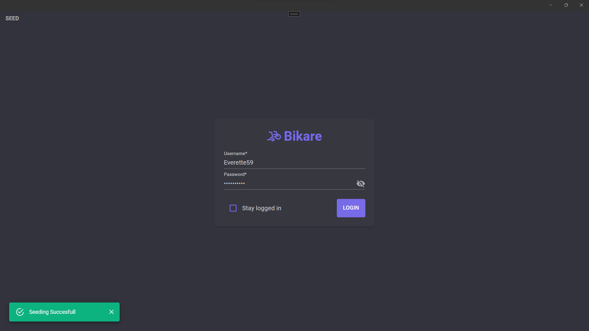
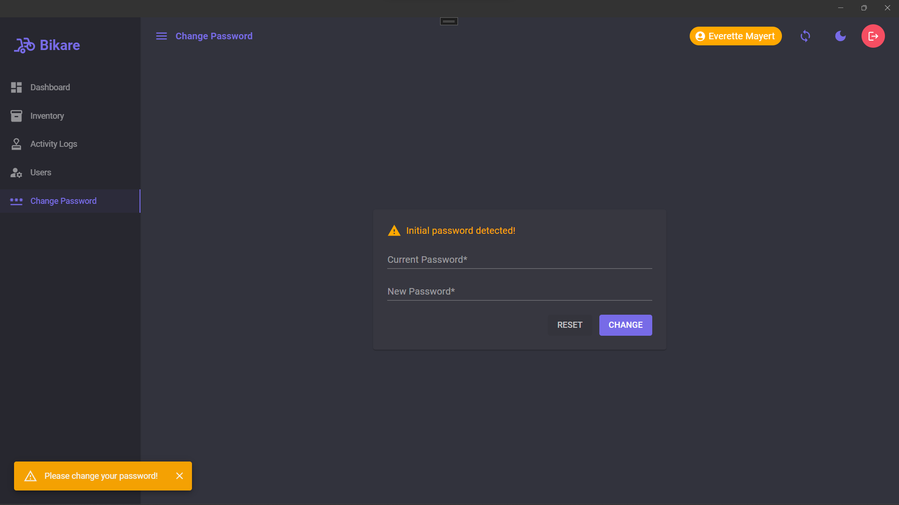
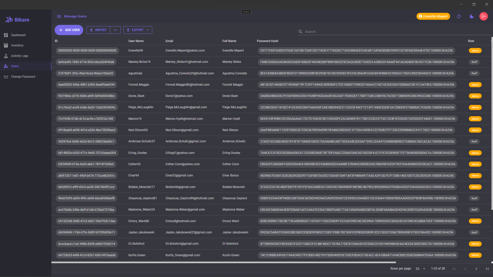
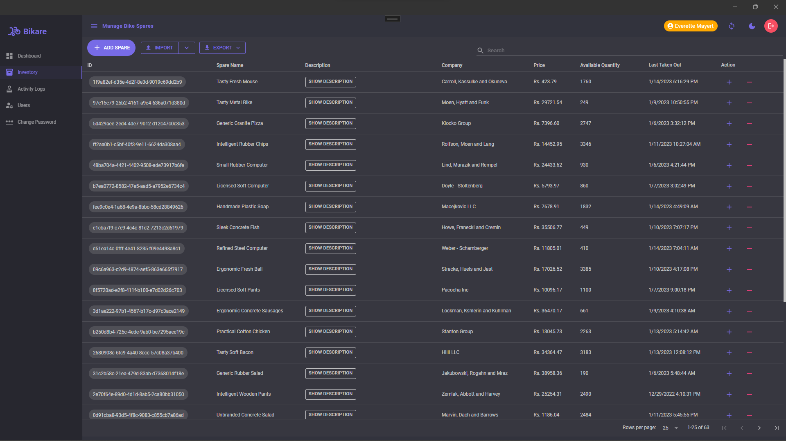
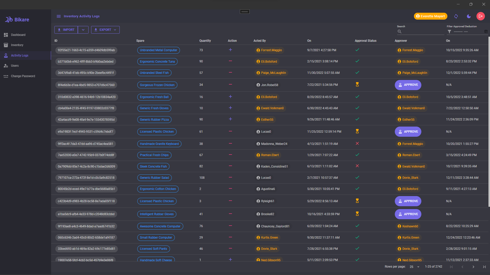
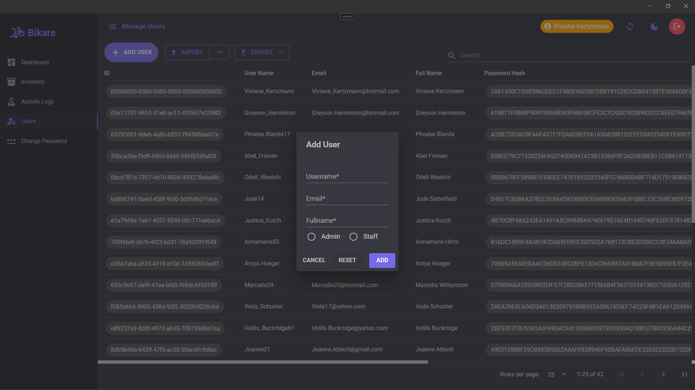
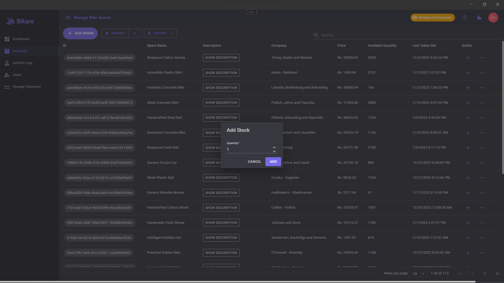
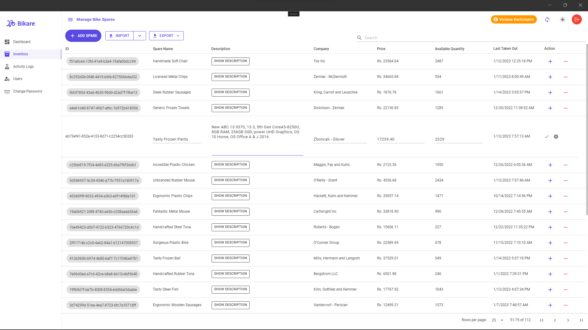

# Bike Spares Inventory System

An Inventory management application made with the **.NET MAUI Blazor** framework following **1-tier Architecture** to manage inventory of bike spare parts in desktop.

## Features

- Role-based Access-Control (Authentication/Authorization)
- Login/Logout
- User Management
- Data seeding for test
- Initial admin-user auto-creation upon first application loading
- Session enabled
  - 8 Hours timeout *default*
  - No timeout
- Direct user to change their password, if initial/system-generated password detected
- Inventory Management
- View Inventory/Activity Logs
- View Dashboard
  - Approved Deducted Items Quantity
  - Disapproved Deducted Items Quantity
  - Pending Deducted Items Quantity
  - Available Items Quantity
- Ability to add stocks to existing spare item
- Ability to remove/deduct stocks of an existing spare item
- Deduction of stock and deduction request approval is constrained by weekdays *MON-FRI* and Work time *9AM - 4PM*
- Supports Dark Mode
- Sync/persist to Disk
- Import/Export User, Inventory, and Inventory Activity Logs
  - Excel *.xlsx*
  - JSON *.json*
  - CSV *.csv*
- Paginated Table
- Good UI/UX

## Role-based Actions

| Action | Admin | Staff | Time & Week Constraint |
| ----------- | ----------- | ----------- | ----------- |
| Manage User | ✔️ | ❌ | ❌ |
| Manage Inventory | ✔️ | ✔️ *Only read* | ❌ |
| Read Activity Logs | ✔️ | ✔️ *Self-related* | ❌ |
| Add Stock(s) | ✔️ | ❌ | ❌ |
| Deduct stock(s) | ✔️ | ✔️ *Request needed* | ✔️ |
| Stock Action Approval | ✔️ | ❌ | ✔️ |
| View Dashboard | ✔️ | ❌ | ❌ |

## Notes

- Manage = Create-Read-Update + search functionality.
- Stock Action = Addition + Deduction of stock
- Activity Logs can be filtered by year and month.
- Staff cannot see who approved/disapproved his/her deduction-request in activity logs.

## Screenshots

## Dependencies

Check out the application dependencies [Here](https://github.com/gcbishal/BikeSparesInventorySystem/network/dependencies).
